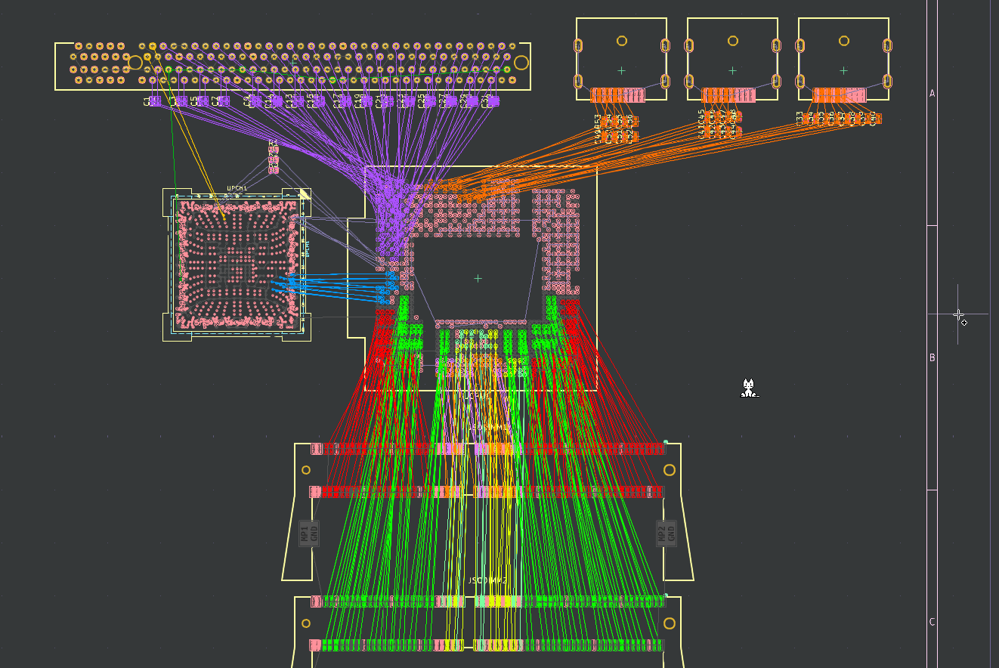
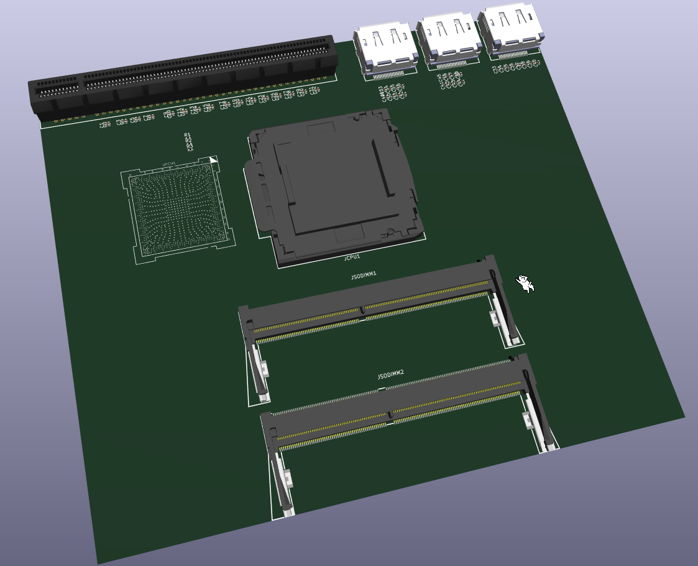

# Stroopwafel LGA1151 Intel Coffee Lake motherboard

Trying to see how far I can get with implementing a modern-ish Intel platform in KiCad using public documentation and leaked schematics.

Here's some work in progress pictures (layout nowhere near final):

Inspired by LCSC carrying LGA1151 sockets: https://www.lcsc.com/product-detail/C2761532.html (thanks for the footprint)

Thanks @mothenjoyer69 for extracting the PCH footprint from a random laptop boardview (LA-F711P)

CPU and PCH schematic symbols fully copied from pdf schematics by hand (took like 3 days...)

It's called Stroopwafel because I was eating a stroopwafel when I was trying to come up with a name.

Mostly using LCFC NM-B551 (Lenovo Tiny5) and Wistron 17557-1 Copperbox (Acer N4660G my beloved) for reference atm

The PCH footprint and symbol in this project should be applicable to (most of) Intel's 300 and 400 series chipsets. 300 series goes with 8th/9th gen and 400 series goes with 10th/11th gen.  
I'll be using a 300-series chipset for this project (probably Z390), since I'm using LGA1151. For 400 series you need LGA1200.

The goal is to create an easy to understand board and schematic layout that breaks out as much of the platform capabilities as possible.

Might build a laptop with a desktop CPU for fun later.

Am I insane? maybe. But I don't really see why I shouldn't try at the moment. It's a fun experiment at least.

No idea what board layout I'll use yet, but I don't feel like using a standard ATX formfactor, there's already plenty of boards like that. I kinda wanna make the PCH and CPU sections modular but I'll have to see about the practicalities of that.

Routing DDR4 will be fun.